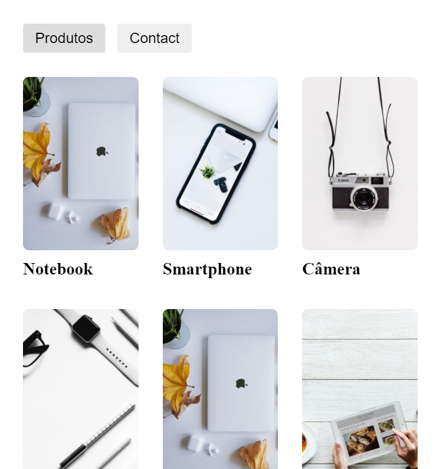
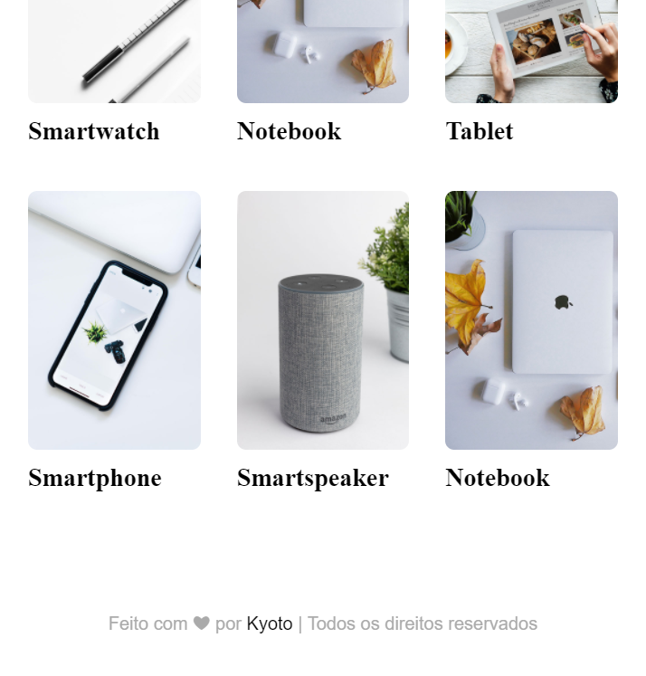

 <p align="center">
 <a href="https://github.com/kyotodevindie">
    
  </a>
</p>
  <h1 align="center">Product View</h1>

  <p align="center">
    A personal project with react to show products, using the Ranek API from <a href="https://www.origamid.com/">Origamid</a>
    <br />
    Created with CodeSandbox
    <br />
    <a href="https://product-view.vercel.app/">View Demo</a>
</p>

<!-- ABOUT THE PROJECT -->

## Prints

<div style="display: grid; grid-template-columns: repeat(3, 1fr); gap: 2rem;">
 




</div>

### Built With

- [React](https://pt-br.reactjs.org/)
- [React-Router-dom 6.0.0 ](https://reactrouter.com/web/guides/quick-start)

### Installation

1. Clone the repo

```sh
git clone https://github.com/kyotodevIndie/product-view.git
```

2. Install the packages using NPM or Yanr

```sh
yarn
```

```sh
npm install
```

3. Happy coding!

<!-- CONTRIBUTING -->

## Contributing

Contributions are what make the open source community such an amazing place to be learn, inspire, and create. Any contributions you make are **greatly appreciated**.

1. Fork the Project
2. Create your Feature Branch (`git checkout -b feature/AmazingFeature`)
3. Commit your Changes (`git commit -m 'Add some AmazingFeature'`)
4. Push to the Branch (`git push origin feature/AmazingFeature`)
5. Open a Pull Request

<!-- LICENSE -->

## License

Distributed under the MIT License. See `LICENSE` for more information.

## Thank you!

   <p> 
    thank you for your patience to read this far! if possible, give a star!
   </p> 
   

